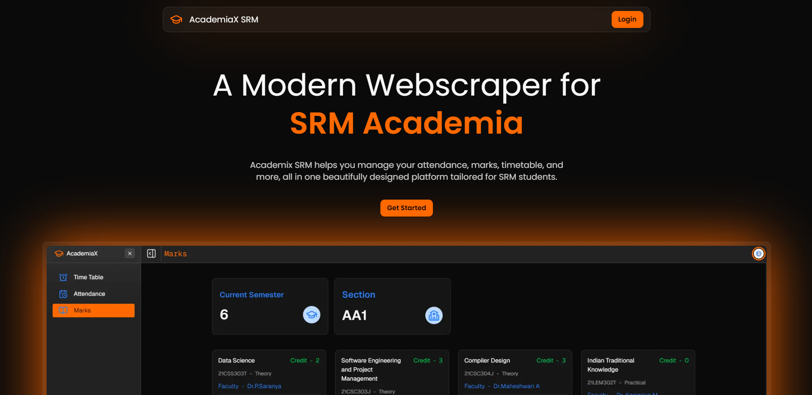

# 🎓 AcademiaX SRM

Welcome to **AcademiaX SRM**! This all-in-one platform is specifically crafted for SRM students to effortlessly manage your **attendance**, **marks**, **timetable**, and so much more—all wrapped in a beautiful, user-friendly design.

## 🚀 Features

- **Real-Time Access**  
  Instantly check your attendance, grades, and marks. Stay on top of your academic game and never miss a beat!

- **Smart Analytics**  
  Utilize advanced OD/ML predictions and an intuitive grade analysis tool to track your progress and map out your academic journey like a pro.

- **Modern UI & Seamless Performance**  
  Enjoy a sleek interface with effortless navigation that makes managing your academic life a breeze.

- **Enhanced Security**  
  Your data is our priority! All information is securely managed on the server side with robust authentication, ensuring your personal details remain completely safe and sound.

## ⚙️ Installation

Get started with AcademiaX SRM in just a few steps:

1. **Clone the repository**:
    ```bash
    git clone https://github.com/jackwaghan/AcademiaX-SRM.git
    ```
2. **Navigate to the project directory**:
    ```bash
    cd AcademiaX-SRM
    ```
3. **Install dependencies**:
    ```bash
    bun install
    ```
Add `.env` file in the root directory

```plaintext
SUPABASE_URL=your_supabase_url_here
SUPABASE_ANON_KEY=your_supabase_anon_key_here
JWT_SECRET=your_jwt_secret_here
NEXT_PUBLIC_DOMAIN=your_next_public_domain_here
BACKEND_URL=your_backend_url_here
NEXT_PUBLIC_GA_TRACKING_ID=your_next_public_ga_tracking_id_here
```

## 📦 Usage

Once you’ve installed the app, it’s time to launch your local development server:

1. **Start the server**:
    ```bash
    bun dev
    ```
2. **Open your browser** and head to `http://localhost:3000` to access the application!

## 🤝 Contributing

We love contributions! If you want to help make AcademiaX SRM even better, follow these steps:

1. **Fork the repository**.
2. **Create a new branch**:
   ```bash
   git checkout -b feature-name
   ```
3. **Commit your changes**:
   ```bash
   git commit -m "Add feature description"
   ```
4. **Push to your branch**:
   ```bash
   git push origin feature-name
   ```
5. **Open a pull request** and let’s get your changes merged!

## 📜 License

This project is licensed under the **MIT License**, which is a permissive free software license widely recognized in the open-source community. This license grants you the freedom to use, copy, modify, merge, publish, distribute, sublicense, and/or sell copies of this project without restrictions.

For a thorough understanding of your rights and obligations, please check the [LICENSE](./LICENSE) file included in the repository. This document covers usage terms, attribution guidelines, and any other legal considerations. **Make sure to read it carefully to ensure compliance and to maximize the potential of this project in your initiatives!**

---

Feel free to tweak any of the sections to better fit your style!
